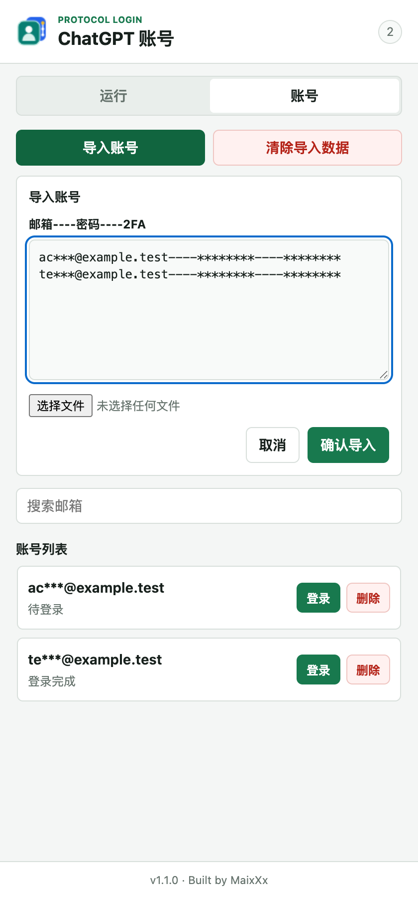
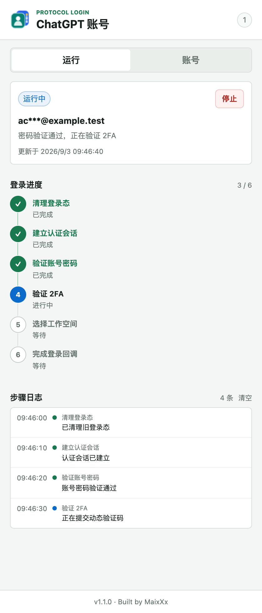

# ChatGPT Protocol Login

独立的 Manifest V3 浏览器扩展。扩展在 Chrome 或 Chromium 内核浏览器中运行，通过 `chatgpt.com` 与 `auth.openai.com` 的同源登录协议完成认证，使登录 Cookie 由浏览器自然写入当前 Cookie Store。

## 安装

1. 下载或克隆源码，确认目录根部包含 `manifest.json`。
2. 在浏览器地址栏打开 `chrome://extensions/`。
3. 开启“开发者模式”。
4. 点击“加载已解压的扩展”，选择包含 `manifest.json` 的目录。
5. 安装完成后，可将扩展固定到浏览器工具栏，方便随时打开侧边栏。

## 支持的账号格式

插件仅支持已经设置登录密码和 TOTP 2FA 的账号。导入时每行一个账号，并严格使用以下三段格式：

```text
账号----密码----2FA密钥
```

账号必须是登录邮箱，三项均不能为空，字段之间使用四个连续连字符 `----` 分隔。2FA 密钥支持 Base32，或带 `secret` 参数的 `otpauth://` 地址。

不支持仅账号密码、邮箱验证码、第三方单点登录、Cookie、Session JSON、Access Token、CSV 或 JSON 等其他导入和认证方式。文档不提供任何真实或可用的账号凭据示例。

## 操作指引

以下图片由真实插件界面配合脱敏模拟状态生成，仅用于说明操作位置，不包含真实账号或可用凭据。

### 1. 导入账号

1. 点击浏览器工具栏中的扩展图标，打开右侧面板。
2. 切换到“账号”页，点击“导入账号”。
3. 在文本框内按每行一个账号粘贴数据，也可以选择一个 `.txt` 文件。
4. 点击“确认导入”。导入成功后，账号会出现在下方列表中。

<p align="center">
  
</p>
<p align="center"><sub>导入界面示意：图片中的邮箱、密码和 2FA 内容均已脱敏且不可用。</sub></p>

### 2. 启动登录

1. 在账号列表中找到目标账号，点击右侧“登录”。
2. 确认提示后，插件会复用当前活动标签页，并清理该 Cookie Store 中已有的 ChatGPT/OpenAI 登录 Cookie。
3. 侧边栏会自动切换到“运行”页，开始执行登录流程。

### 3. 查看运行进度

“运行”页会显示当前账号、任务状态、6 个登录步骤和逐步日志。绿色步骤表示已经完成，蓝色步骤表示正在执行，灰色步骤表示等待执行。

<p align="center">
  
</p>
<p align="center"><sub>运行界面示意：当前已完成密码验证，正在验证 TOTP 2FA。</sub></p>

### 4. 完成或处理异常

- 登录成功后，状态会变为“完成”，插件会立即删除该账号已导入的账号、密码和 2FA 密钥。
- 需要中止时，点击运行页右上角的“停止”。当前登录标签页会保留，便于查看现场状态。
- 如果出现邮箱验证码或其他未支持的安全挑战，任务会停止并显示原因，不会尝试绕过验证。

## 登录流程

```text
ChatGPT CSRF
  -> OpenAI signin
  -> 密码验证
  -> TOTP challenge/verify
  -> 工作空间选择
  -> ChatGPT callback
  -> /api/auth/session 邮箱校验
```

## 数据与安全

账号凭据只保存在 `chrome.storage.session`。浏览器关闭后会自动清除，不会写入 `chrome.storage.local`。单个账号登录成功后，插件会立即删除导入账号中的账号、密码和 2FA 密钥，只在当前浏览器会话中保留脱敏后的任务结果与步骤日志。

“清除导入数据”会删除所有剩余的导入账号、任务结果和步骤日志，但不会清理 ChatGPT Cookie，也不会退出当前已登录账号。开始一次新登录时，插件会复用当前活动标签页，并清理当前 Cookie Store 中与 ChatGPT/OpenAI 登录相关的 Cookie。

如果认证流程要求邮箱验证码或其他未支持的安全挑战，任务会停止并保留当前标签页，不会尝试绕过或降级为页面元素自动填写。

该扩展复用了 ChatGPT Web 当前使用的内部认证端点。这些端点不属于 OpenAI 官方公开 API 的稳定性承诺，页面登录协议变化后可能需要同步更新扩展。

## 测试

```bash
npm test
```
